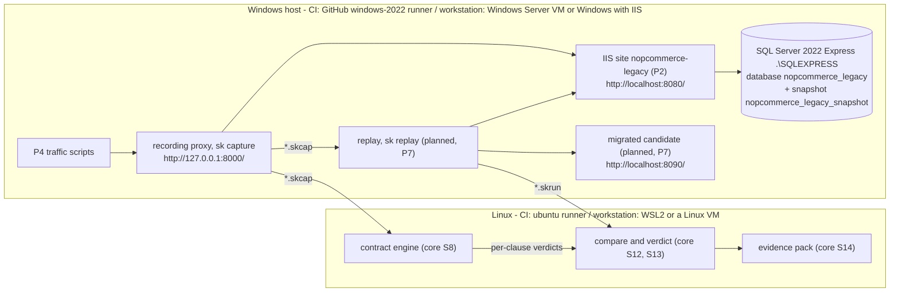

# Demo topology — decision D7 (proposed)

> **Status: proposed.** The legacy half is built and running in CI (P1, P2). The parts
> marked *planned* describe how P4–P7 are expected to plug in; their tickets may refine
> them, and should update this page when they do.

## The decision

**One Windows host runs the legacy side. Linux runs the rest of the chain.**

- The legacy shop needs Windows: nopCommerce 3.90 is ASP.NET MVC 5 on .NET Framework,
  served by IIS, backed by SQL Server. One Windows host carries all three.
- The Second Key chain — capture, replay, compare, evidence — is .NET 10 and runs
  anywhere; Linux is its natural home (cheaper runners, faster start, containers).
- The components exchange **files**, never each other's internals (`*.skcap`,
  `contract.yaml`, `*.skrun`, `verdict.json`, `*.sarif`; see the core repository's
  work plan). So the machine boundary can sit anywhere those files can be copied.
- Only two steps must reach the running shop over HTTP: **capture** (P4) and
  **replay** (P7). They run wherever the shop is reachable. Everything downstream is
  file in, file out.

## Picture



## Names, ports and places

| What | Value | Set by |
|---|---|---|
| Legacy shop | `http://localhost:8080/` | [`scripts/4-deploy-and-install.ps1`](../scripts/4-deploy-and-install.ps1) `-Port` |
| IIS site and application pool | `nopcommerce-legacy`, .NET CLR v4.0, integrated pipeline, no idle time-out, no periodic recycle | step 4 `-SiteName` |
| Site identity | `IIS APPPOOL\nopcommerce-legacy`: Modify on the site folder, `dbcreator` on SQL Server, nothing else | step 4 |
| Site folder | `C:\inetpub\nopcommerce-legacy` | step 4 `-InstallDir` |
| SQL Server | SQL Server 2022 Express, instance `.\SQLEXPRESS`, server collation `SQL_Latin1_General_CP1_CI_AS`; local connections use shared memory | [`scripts/3-install-iis-sql.ps1`](../scripts/3-install-iis-sql.ps1), [`pins.json`](../pins.json) |
| Database | `nopcommerce_legacy`, created by nopCommerce's installer with the pinned collation, sample data, Windows authentication (no password anywhere) | step 4 `-DatabaseName` |
| Store administrator | `admin@nopbench.invalid`, password generated per run, kept in `<work>\secrets\legacy-admin.json` | step 4 |
| Recording proxy (P4) | `http://127.0.0.1:8000/` → `http://localhost:8080/` | [`scripts/7-record-traffic.ps1`](../scripts/7-record-traffic.ps1) `-ProxyUrl` |
| Database snapshot (P4) | `nopcommerce_legacy_snapshot`, taken after the store configuration; restored before every scenario | step 7 |
| Candidate (planned, P7) | `http://localhost:8090/`, its own database copy | P7 |
| P3 warm-up: eShopLegacyMVC | `http://localhost:8081/`, IIS site `eshop-legacy`, mock data (no database) | [`scripts/eshop/2-deploy-eshop.ps1`](../scripts/eshop/2-deploy-eshop.ps1) |
| P3 warm-up: recording proxy | `http://127.0.0.1:8001/` → `http://localhost:8081/` | [`scripts/eshop/3-record-eshop.ps1`](../scripts/eshop/3-record-eshop.ps1) |

`<work>` is the scripts' work root: `C:\nopbench` by default, `D:\a\_temp\nopbench` on a
hosted runner (`NOPBENCH_WORK`).

## In CI

```
legacy-build.yml
  lint  (ubuntu-24.04)   PSScriptAnalyzer on scripts/
  build (windows-2022)   1-fetch -> 2-build          -> artifact legacy-site (site + manifest)
  tools (ubuntu-24.04)   chain-tools.yml: sk and Portcullis at their pinned commits -> chain-tools
  iis   (windows-2022)   needs build, tools: 3-install-iis-sql -> 4-deploy-and-install -> 5-smoke
                         -> 6-configure-store -> 7-record-traffic (sk capture) -> nopcommerce-traffic

warmup-eshop.yml (P3)
  tools   (ubuntu-24.04)  chain-tools.yml: sk and Portcullis at their pinned commits -> chain-tools
  legacy  (windows-2022)  eshop 1-build -> IIS -> 2-deploy -> 3-record (sk capture)
                          -> 4-replay (sk replay, A/A) -> 5-scan (Portcullis) -> eshop-recordings
  verdict (ubuntu-24.04)  6-verdict: sk compare, sk gate, sk evidence       -> eshop-evidence-pack
```

The warm-up is the first run of the split described below: everything that needs the
running application on the Windows runner, everything that is file in, file out on Linux
([ADR 0004](adr/0004-chain-tools-and-eshop-warmup.md)).

GitHub-hosted runners do not share a network: a job on a Linux runner cannot reach IIS
on a Windows runner. That is why capture and replay are planned **inside the Windows
job**, next to IIS — `sk` is cross-platform .NET 10, so running it on Windows costs
nothing. What they produce (`*.skcap`, `*.skrun`) leaves the job as an artifact, and the
file-in/file-out steps (contract checks, compare, evidence) run on a Linux job.

Measured on `windows-2022`: the build job takes about 1.5 minutes; the host job adds
IIS, SQL Server Express and the installer (timings in each run's job summary and in
`state\platform.json` and `state\deploy.json`).

## On a workstation

The same scripts, in the same order, on one of:

- **A Windows Server 2022 VM under Hyper-V** (evaluation media is enough for a demo;
  4 vCPU and 8 GB are comfortable), or
- **A Windows 10/11 Pro or Enterprise machine with IIS.** The scripts enable IIS through
  DISM optional features, whose names are the same on client and server Windows.

Run steps 1–5 in an elevated PowerShell on that host (steps 1 and 2 need no elevation;
[`scripts/README.md`](../scripts/README.md) has the details). For the Linux side (WSL2,
or a Linux VM on the same virtual switch) to reach the shop, open the port on the Windows
host — CI does not need this, so the scripts do not do it:

```powershell
New-NetFirewallRule -DisplayName 'nopbench legacy 8080' -Direction Inbound -Protocol TCP -LocalPort 8080 -Action Allow
```

Then, from Linux: `pwsh scripts/5-smoke.ps1 -BaseUrl http://<windows-host>:8080/` — the
smoke test runs on PowerShell 7 on Linux as well.

## How P4 records traffic

1. **Known state.** `4-deploy-and-install.ps1` gives a known starting point: new site,
   new database, the installer's sample data; `6-configure-store.ps1` applies the traffic
   plan's store configuration through the admin UI. Step 7 then takes a SQL Server
   database snapshot and restores it before every scenario, so recording and both
   replays start from the same data — `sk replay`'s `sqlServerSnapshot` reset restores
   the same snapshot.
2. **Recording proxy in front of IIS.** `sk capture` (a YARP recording proxy, inbound
   only, writing `*.skcap`) listens on `127.0.0.1:8000` and forwards to `:8080`, on the
   same Windows host. The legacy system is untouched: no code change, no recompilation,
   no IIS module.
3. **Scripted traffic through the proxy, never around it.** The scenarios of
   [`P4-TRAFFIC-PLAN.md`](P4-TRAFFIC-PLAN.md) drive the shop as a browser would —
   one cookie jar per scenario, anti-forgery tokens read from each form — against
   `http://127.0.0.1:8000/`. Each scenario is one session in the capture: every request
   carries `x-bench-scenario: <id>`, the capture's session key.
4. **Host.** `sk capture` sends the target's host upstream (YARP's default), so the
   absolute URLs nopCommerce builds from the request host — the one-page checkout's
   script URLs — name `:8080`. A browser following them would leave the proxy; the
   scripted sessions request relative paths only, so nothing bypasses the recording.
5. **Output:** one `*.skcap` per run, uploaded as the `nopcommerce-traffic` artifact
   with `state\traffic.json`, which names the site manifest digest, so the recording
   names the exact legacy build it observed.

## What the host adds to behaviour — and is therefore fixed

| Setting | Value | Why it matters |
|---|---|---|
| SQL collation | `SQL_Latin1_General_CP1_CI_AS`, pinned for the server and the database | Ordering and equality in queries (catalog sort, search) |
| .NET Framework runtime | 4.8 (the host's), running an application built for 4.5.1 | In-place runtime: what every production host of this shop runs |
| Culture | `en-US`, set per request by nopCommerce from the store language | Price and date formatting; the NLS → ICU comparison in P7 is about the runtime, so both sides must see the same culture |
| Time zone | UTC on hosted runners | Discount validity, order dates, "new" products |
| Compression | not installed | Recorded bodies stay plain; compression belongs to transport, not to the contract |
| Clock | real time | Not controllable without touching the legacy code; the comparator normalises times instead (core S12) |
